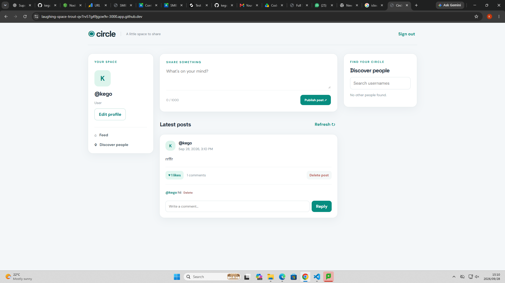
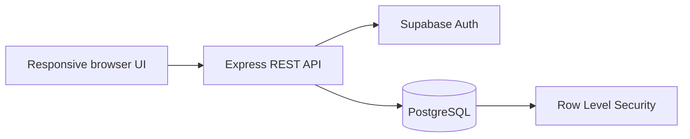

  

<h1 align="center">Circle</h1>

  <strong>A clean, responsive mini social network built as a CodeAlpha Internship Project.</strong>

  Circle brings profiles, posts, comments, likes and follows together in a focused full-stack application powered by Express.js and Supabase.

  
  

  

## About Circle

Circle is a compact social media platform that demonstrates a complete modern web application: authentication, user-owned content, relational data, protected API routes and a polished responsive interface. It was developed for the **CodeAlpha internship** to showcase practical full-stack JavaScript development.

The experience is intentionally simple—members can create a profile, share posts, join conversations, like content, follow other users and discover people from one uncluttered feed.

## Features

- Secure email and password registration and sign-in
- Editable user profiles with unique usernames and bios
- Create and delete posts
- Add and remove comments
- Like and unlike posts
- Follow and unfollow other members
- Search and discover profiles
- Paginated, newest-first social feed
- Responsive layout for desktop, tablet and mobile
- Friendly validation and error feedback

## Languages and tools

  
  &nbsp;&nbsp;
  
  &nbsp;&nbsp;
  
  &nbsp;&nbsp;
  
  &nbsp;&nbsp;
  
  &nbsp;&nbsp;
  
  &nbsp;&nbsp;
  
  &nbsp;&nbsp;
  
  &nbsp;&nbsp;
  

  HTML5 · CSS3 · JavaScript · Node.js · Express.js · Supabase Auth · PostgreSQL · GitHub · Codespaces

| Layer | Technology | Responsibility |
| --- | --- | --- |
| Interface | HTML5, CSS3, vanilla JavaScript | Responsive screens and user interactions |
| Server | Node.js and Express.js | Protected REST API, validation and business logic |
| Authentication | Supabase Auth | Account registration, sign-in and session tokens |
| Database | Supabase PostgreSQL | Profiles, posts, comments, likes and follower relationships |
| Security | PostgreSQL Row Level Security | Ownership rules enforced at the data layer |
| Development | GitHub and Codespaces | Source control and cloud development environment |

## How it works

The browser signs users in with Supabase Auth and sends the session access token with each request to the Express API. Express verifies the authenticated user before reading or changing social data. PostgreSQL foreign keys preserve relationships between records, while Row Level Security policies ensure members can only change content they own.

## Data model

| Table | Purpose |
| --- | --- |
| `social_profiles` | Public usernames, bios and account-linked profiles |
| `social_posts` | User-authored feed posts |
| `social_comments` | Conversations attached to posts |
| `social_likes` | One like per user and post |
| `social_follows` | Follower and following relationships |

## API highlights

Circle exposes focused Express routes for the signed-in profile, people discovery, the paginated feed, posts, comments, likes and follows. Requests are validated on the server and protected again by PostgreSQL policies, providing security at both the application and database layers.

## CodeAlpha internship

This project demonstrates the core skills expected from a full-stack internship project: responsive interface design, REST API development, authentication, relational database modelling, CRUD operations, secure authorization and Git-based delivery.

  Built by <a href="https://github.com/kegodev"><strong>Kegorapetse Mangena</strong></a> as part of the CodeAlpha Internship.

  <em>The live preview is hosted from GitHub Codespaces and is available while the project Codespace is running.</em>

